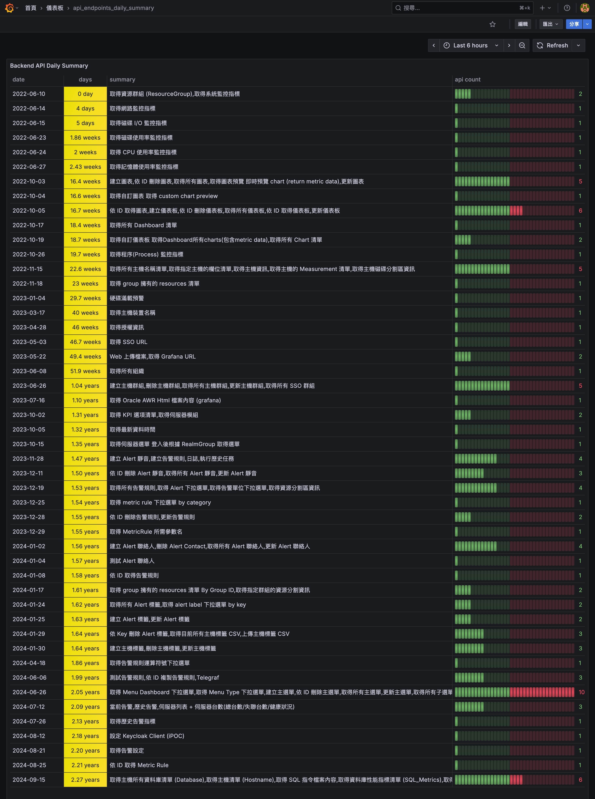

# API Endpoint Git Tracker (Go)

<p align="center">
  
  
  
  
  
  
</p>

一個用 Go 語言實現的簡單的 HTTP 服務器，用於提供 API endpoints 的 CSV 數據。



## 特點

- **輕量級 HTTP 服務器**: 使用 Go 標準庫實現，無外部依賴
- **雙重 API 端點**: 提供原始數據和聚合統計數據
- **Grafana 整合**: 與 Infinity Plugin 完美配合
- **即時數據**: 直接從 CSV 文件提供數據，無需數據庫
- **錯誤處理**: 完善的錯誤處理和日誌記錄

## 依賴項

- Go 1.19 或更高版本
- 無外部依賴（僅使用 Go 標準庫）

## 安裝

1. 確保已安裝 Go 1.19+：
```bash
go version
```

2. 從 GitHub 下載此項目

```bash
git clone https://github.com/detectviz/api-endpoint-git-tracker-go.git
```
3. 確保項目目錄中包含必要的 CSV 文件：
- `api_endpoints_with_summary.csv`
- `api_endpoints_daily_summary.csv`

**獲取 CSV 文件：** 這些 CSV 文件可以從 [detectviz/api-endpoint-git-tracker](https://github.com/detectviz/api-endpoint-git-tracker) 項目使用其分析腳本從 Swagger/OpenAPI 文件中產生。

## 項目結構

``` bash
api-endpoint-git-tracker-go/
├── main.go                            # 主程序文件
├── go.mod                             # Go 模組文件
├── api_endpoints_with_summary.csv     # API endpoints 原始數據
├── api_endpoints_daily_summary.csv    # 每日統計數據
├── api_endpoints_daily_summary.jpg    # Grafana 儀表板截圖
├── api_endpoints_daily_summary.json   # Grafana 儀表板配置
└── README.md                          # 說明文件
```

## 運行服務器

```bash
cd api-endpoint-git-tracker-go
go run main.go
```

服務器將在 http://localhost:8005 上運行。

## API 端點

### GET /api_endpoints_with_summary.csv

返回 CSV 格式的 API endpoints 數據。

#### 響應格式
- **Content-Type**: `text/csv; charset=utf-8`
- **格式**: CSV
- **欄位**:
  - `Time`: API endpoint 的首次提交日期
  - `Field`: API endpoint 路徑
  - `Value`: API endpoint 的摘要描述

#### 示例響應
```csv
Time,Field,Value
2022-06-10,/get-server-group,取得資源群組 (ResourceGroup)
2022-06-10,/get-system-metric,N/A
2023-05-22,/user/file-upload,Web 上傳檔案
```

### GET /api_endpoints_daily_summary.csv

返回按日期聚合的 CSV 格式數據，統計每天的 API endpoints 數量、摘要和天數。

#### 響應格式
- **Content-Type**: `text/csv; charset=utf-8`
- **格式**: CSV
- **欄位**:
  - `date`: 日期
  - `days`: 從起始日期開始的天數
  - `count`: 當天 API endpoints 的數量
  - `summary`: 當天所有非 N/A 摘要的逗號拼接

#### 示例響應
```csv
date,days,count,summary
2022-06-10,0,2,"取得資源群組 (ResourceGroup),取得系統監控指標"
2022-06-14,4,1,"取得網路監控指標"
2023-05-22,346,2,"Web 上傳檔案,Get Grafana URL"
```

#### 使用示例

```bash
curl http://localhost:8005/api_endpoints_with_summary.csv
curl http://localhost:8005/api_endpoints_daily_summary.csv
```

或在瀏覽器中訪問：
- http://localhost:8005/api_endpoints_with_summary.csv
- http://localhost:8005/api_endpoints_daily_summary.csv

## Grafana 儀表板整合

### CSV + Infinity Plugin

使用 Infinity Plugin 可以直接在 Grafana 中讀取和視覺化 CSV 數據。

#### 外掛名稱
[yesoreyeram-infinity-datasource](https://grafana.com/grafana/plugins/yesoreyeram-infinity-datasource/)

#### 功能特點
- 直接讀取 CSV / JSON / XML / GraphQL / Google Sheet
- 支援 HTTP 或本地路徑
- 可轉為 Time series、Table、Logs 等 Grafana 視覺格式

#### 設定

**Infinity 資料源設定：**
- **Type**：CSV
- **URL**：`http://localhost:8005/api_endpoints_daily_summary.csv`

設定完成後，即可在 Grafana 中以 Table 格式顯示 API 新增時間軸。

#### 建議
- 輕量級方案：Infinity Plugin (CSV 模式)
- 若要自動化更新或結合其他資料源，建議轉入 SQLite 或 InfluxDB

## 快速開始

1. 啟動服務器：
```bash
go run main.go
```

2. 測試端點：
```bash
curl http://localhost:8005/api_endpoints_with_summary.csv
curl http://localhost:8005/api_endpoints_daily_summary.csv
```

3. 在 Grafana 中配置 Infinity 資料源並建立儀表板
